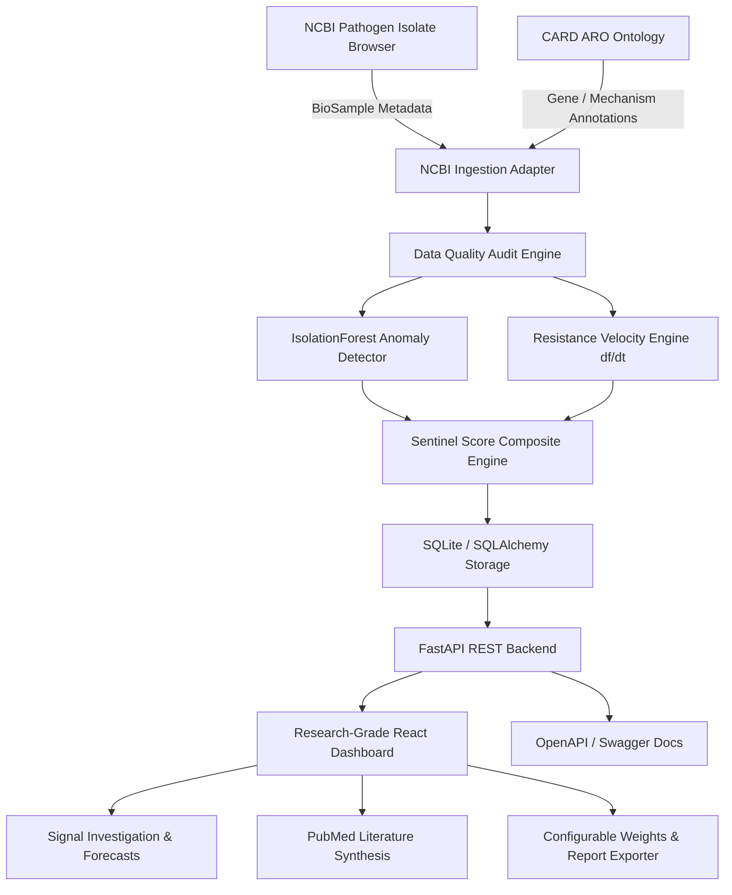

# 🛡️ AMR-Sentinel V2 — Autonomous Global Antimicrobial Resistance Intelligence Network

[](https://github.com/Rohith-888-destroyer/AMR-Pattern-Novelty)
[](https://python.org)
[](https://fastapi.tiangolo.com)
[](https://vitejs.dev)
[](https://opensource.org/licenses/MIT)

**AMR-Sentinel** is an autonomous computational surveillance and intelligence platform designed for bioinformatics researchers, microbiologists, and public health surveillance teams. It integrates public genomic metadata (NCBI Pathogen Isolate Browser), gene ontologies (CARD ARO), and temporal statistical engines to identify, investigate, and validate emerging Antimicrobial Resistance (AMR) signals globally.

> ⚕️ **Non-Clinical Research Platform**: AMR-Sentinel operates on observational computational surveillance signals derived from public metadata. It does **NOT** diagnose patients, recommend antibiotic treatment, or make clinical decisions.

---

## 🏗️ Architecture



---

## ⚡ Data Flow & Modes

### Data Flow Overview
```
DATA SOURCE (NCBI Pathogen Portal / CARD ARO)
       ↓
DATA INGESTION & ANNOTATION (ncbi_adapter.py & card_adapter.py)
       ↓
DATA CLEANING & NOVELTY DETECTION (novelty_detector.py)
       ↓
DATA STORAGE (amr_sentinel.db / SQLite)
       ↓
ML & SIGNAL ANALYSIS (velocity_engine.py & evidence_scorer.py)
       ↓
FASTAPI REST BACKEND (backend/app/main.py)
       ↓
SAME-ORIGIN VERCEL REWRITE / API CLIENT (dashboard/src/lib/api.ts)
       ↓
REACT/VITE DASHBOARD UI
```

### Data Modes
The top header status bar dynamically displays the active dataset state:
- 🟢 **LIVE DATA (`mode: live`)**: Successfully fetched and processed live metadata from NCBI Entrez E-utilities and Pathogen Isolate Browser.
- 🟡 **CACHED DATA / STRUCTURED SEED DATASET (`mode: demo` / `mode: cached`)**: Pre-processed, scientifically representative seed dataset bundled with the repository (card.mcmaster.ca CARD ARO aligned).
- 🔴 **DATA UNAVAILABLE (`mode: unavailable`)**: Displayed when backend data source cannot be reached, preserving scientific integrity without masking API errors as zero statistics.

---

## 💻 Local Development

### 1. Prerequisites
- Python 3.10+
- Node.js 18+

### 2. Backend Setup
```bash
# Clone the repository
git clone https://github.com/Rohith-888-destroyer/AMR-Pattern-Novelty.git
cd AMR-Pattern-Novelty

# Install Python dependencies
pip install -r requirements.txt

# Run database seed pipeline (populates data/amr_sentinel.db)
python -m scripts.run_pipeline

# Start FastAPI backend
uvicorn backend.app.main:app --reload --port 8000
```
- Interactive Swagger API Documentation: `http://localhost:8000/docs`

### 3. Frontend Setup
```bash
cd dashboard
npm install
npm run dev
```
- Open `http://localhost:5173` in your browser. Development requests to `/api/*` are proxied directly to `http://127.0.0.1:8000`.

---

## 🚀 Production Deployment (Vercel)

The application is configured for single-origin Vercel deployment:
- **Build Command**: `cd dashboard && npm install && npm run build`
- **Output Directory**: `dashboard/dist`
- **Rewrites**:
  - `/api/(.*)` → `/api/index.py` (FastAPI serverless handler)
  - `/(.*)` → `/index.html` (Vite single page app)

### Database Cold-Start Resilience
Vercel serverless functions execute on ephemeral instances. To ensure immediate response times under 50ms without hitting rate limits or timeouts:
1. `data/amr_sentinel.db` is bundled with the deployment.
2. On serverless function initialization, `ensure_db_ready()` automatically copies `data/amr_sentinel.db` to `/tmp/amr_sentinel.db` if `/tmp` is uninitialized.
3. The React frontend interacts with the API using same-origin relative endpoints (`/api/...`), using `import.meta.env.VITE_API_BASE_URL` if cross-origin host is explicitly set.

---

## 📡 REST API Reference

| Endpoint | Method | Description |
| :--- | :--- | :--- |
| `/api/health` | `GET` | System status, dataset mode, pipeline readiness, record counts |
| `/api/data-status` | `GET` | Data status badge info, dataset version, run ID, completeness score |
| `/api/overview` | `GET` | Top-level dashboard metrics (observations, active signals, score, countries) |
| `/api/signals` | `GET` | Ranked emerging AMR signals with velocity and Sentinel Score |
| `/api/signals/{id}` | `GET` | Single signal details |
| `/api/signals/{id}/investigation` | `GET` | Signal deep-dive (time series, 3-month forecast, score decomposition) |
| `/api/map` | `GET` | Geographic surveillance hotspots, coordinates, velocity, signal levels |
| `/api/coverage` | `GET` | Regional sequencing throughput and surveillance blind spots |
| `/api/clusters` | `GET` | IsolationForest AMR pattern clusters with novelty scores |
| `/api/knowledge-graph` | `GET` | Multi-relational graph (Pathogen → Gene → Mechanism → Drug Class → Region) |
| `/api/timeline` | `GET` | Aggregated monthly isolate observation counts |
| `/api/what-changed` | `GET` | Weekly intelligence briefing highlights |
| `/api/data-quality` | `GET` | 8-dimension data completeness audit matrix |
| `/api/model-validation` | `GET` | Benchmark evaluation metrics (Precision, Recall, F1, ROC-AUC, PR-AUC) |
| `/api/literature` | `GET` | Peer-reviewed PubMed citations aligned to pathogen-gene pairs |
| `/api/data-sources` | `GET` | Open data provenance and licensing details |
| `/api/search` | `POST` | Multi-criteria search across observations, signals, and literature |
| `/api/config/recalculate` | `POST` | Recalculate Sentinel Scores with custom research weights |
| `/api/export/report/{id}` | `GET` | Downloadable research report JSON payload |

---

## 🔧 Troubleshooting

### Problem: Dashboard displays "Data Unavailable" red banner
- **Cause**: Backend API could not be reached or SQLite database failed to initialize.
- **Fix**: Click **Retry Connection** or **Refresh** in the top bar. Ensure backend server is running (`uvicorn backend.app.main:app --port 8000`) locally, or verify Vercel serverless function logs.

### Problem: Database missing locally
- **Fix**: Run `python -m scripts.run_pipeline` to re-generate `data/amr_sentinel.db`.

---

## 📄 License & Data Attributions

- **Code License**: MIT License
- **Genomic Metadata**: NCBI Pathogen Isolate Browser ([NCBI Public Domain](https://www.ncbi.nlm.nih.gov/pathogens/))
- **Gene Ontology**: CARD - Comprehensive Antibiotic Resistance Database ([CC BY-NC-SA 4.0](https://card.mcmaster.ca))
- **Literature**: PubMed / NCBI E-utilities (Open Access)
