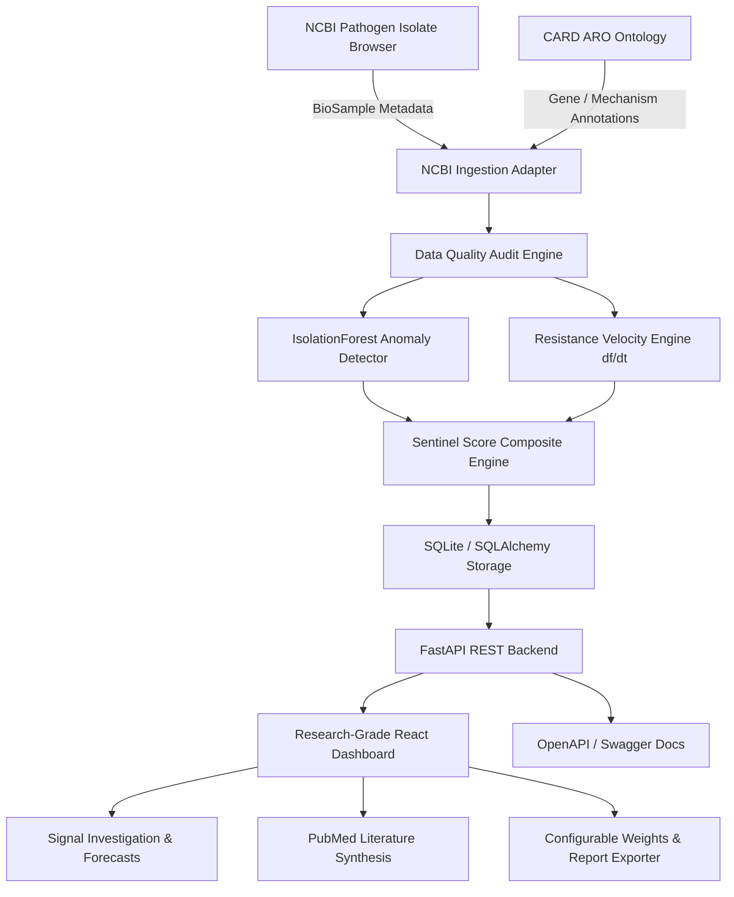

# 🛡️ AMR-Sentinel V2 — Autonomous Global Antimicrobial Resistance Intelligence Network

[](https://antimicrobial-resistance-rcvs7tjl0-rohith-ashwa-vardhan.vercel.app)
[](https://python.org)
[](https://fastapi.tiangolo.com)
[](https://vitejs.dev)
[](https://opensource.org/licenses/MIT)

**AMR-Sentinel** is an autonomous computational surveillance and intelligence platform designed for bioinformatics researchers, microbiologists, and public health surveillance teams. It integrates public genomic metadata (NCBI Pathogen Isolate Browser), gene ontologies (CARD ARO), and temporal statistical engines to identify, investigate, and validate emerging Antimicrobial Resistance (AMR) signals globally.

> ⚕️ **Non-Clinical Research Platform**: AMR-Sentinel operates on observational computational surveillance signals derived from public metadata. It does **NOT** diagnose patients, recommend antibiotic treatment, or make clinical decisions.

---

## 🏗️ Architecture



---

## ✨ Key Features in V2

1. **Top-Level Data Status & Provenance**: Live Data Status header displaying dataset version, last update timestamp, total isolate record counts, and overall **Data Completeness Score (e.g. 84.5 / 100)**.
2. **Ranked AMR Signal Radar**: Multi-factor ranking of priority signals categorised into *Critical*, *High*, *Moderate*, and *Low* priority for further scientific investigation.
3. **Signal Investigation Page**: Detailed deep-dive view providing interactive time-series trend analysis, 3-month forecast projections with $95\%$ confidence bounds, Sentinel Score radial decomposition, and score contribution breakdowns.
4. **Peer-Reviewed Literature Synthesis**: PubMed citation engine linking published papers (PMID, DOI, Journal, Year) to pathogen-gene combinations with alignment strength indicators.
5. **Data Quality & Completeness Dashboard**: Audit matrix evaluating missing accessions, collection date resolution, CARD gene annotation depth, and regional sequencing throughput.
6. **Empirical Model Validation Benchmark**: Benchmark metrics comparing Baseline rules vs IsolationForest vs Sentinel Score composite engine across Precision, Recall, F1-Score, and ROC-AUC.
7. **Configurable Sentinel Score Weights**: Interactive UI modal allowing researchers to adjust parameters (Velocity %, Novelty %, Expansion %, Coverage %, Consistency %) to evaluate custom research hypotheses.
8. **Research Reproducibility Tracking**: Automated assignment of unique **RUN IDs** (e.g., `AMR-2026-08-09-001`), software versions, and query parameters for full experimental reproducibility.
9. **One-Click Report Export**: Downloadable signal research reports in formatted JSON and CSV payloads.

---

## 🧮 Sentinel Score Formulation

The **Sentinel Score ($S$)** is a composite 0–100 computational metric synthesized from five observational dimensions:

$$S = w_1 \cdot V + w_2 \cdot N + w_3 \cdot E + w_4 \cdot C + w_5 \cdot T$$

Where default normalized weights are:
- **Resistance Velocity ($V$, $w_1 = 30\%$)**: Temporal rate of change of gene frequency ($v = df / dt$).
- **Genomic Novelty ($N$, $w_2 = 25\%$)**: Unsupervised IsolationForest anomaly score on pathogen-gene-country feature vectors.
- **Geographic Expansion ($E$, $w_3 = 20\%$)**: Number of distinct country surveillance sites detecting the signal.
- **Data Coverage & Quality ($C$, $w_4 = 15\%$)**: Isolate sample size and metadata completeness.
- **Temporal Consistency ($T$, $w_5 = 10\%$)**: Multi-period observation consistency rate.

---

## 🚀 Quick Start (Local Setup)

### 1. Prerequisites
- Python 3.12+
- Node.js 18+

### 2. Backend Setup
```bash
# Clone the repository
git clone https://github.com/Rohith-888-destroyer/ANTIMICROBIAL-RESISTANCE.git
cd ANTIMICROBIAL-RESISTANCE

# Install Python dependencies
pip install -r requirements.txt

# Seed database and compute initial AMR signals
python scripts/run_pipeline.py

# Run FastAPI backend
uvicorn backend.app.main:app --reload --port 8000
```
- Interactive Swagger API Documentation: `http://localhost:8000/docs`

### 3. Frontend Setup
```bash
cd dashboard
npm install
npm run dev
```
- Open `http://localhost:5173` in your browser.

---

## 🧪 Running Unit Tests

```bash
pytest
```
All unit tests verify API endpoints, data adapters, velocity engine, evidence scorer, literature synthesis, and model validation benchmarks.

---

## 📡 REST API Reference

| Endpoint | Method | Description |
| :--- | :--- | :--- |
| `/api/health` | `GET` | Health check & engine status |
| `/api/data-status` | `GET` | Data provenance, run ID, and completeness score |
| `/api/overview` | `GET` | Dashboard top-level intelligence metrics |
| `/api/signals` | `GET` | Ranked emerging AMR signals |
| `/api/signals/{id}/investigation` | `GET` | Signal deep-dive (time series, forecast, literature) |
| `/api/search` | `POST` | Multi-criteria researcher search engine |
| `/api/literature` | `GET` | Peer-reviewed PubMed citations |
| `/api/data-quality` | `GET` | Data completeness and metadata audit |
| `/api/model-validation` | `GET` | Benchmark evaluation metrics (Precision, Recall, F1, ROC-AUC) |
| `/api/config/recalculate` | `POST` | Recalculate Sentinel Scores with custom weights |
| `/api/export/report/{id}` | `GET` | Export downloadable research report (JSON/CSV) |

---

## 📄 License & Data Attributions

- **Code License**: MIT License
- **Genomic Metadata**: NCBI Pathogen Isolate Browser ([NCBI Public Domain](https://www.ncbi.nlm.nih.gov/pathogens/))
- **Gene Ontology**: CARD - Comprehensive Antibiotic Resistance Database ([CC BY-NC-SA 4.0](https://card.mcmaster.ca))
- **Literature**: PubMed / NCBI E-utilities (Open Access)
